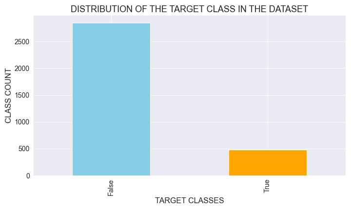
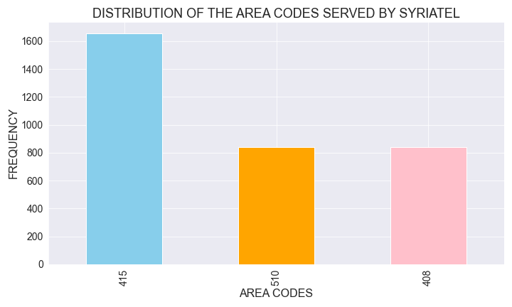
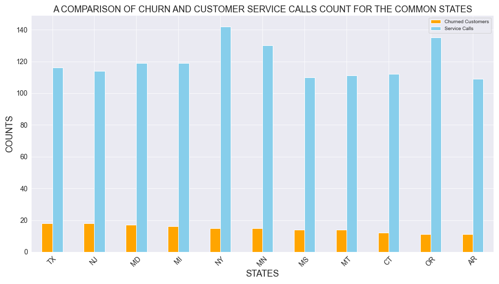
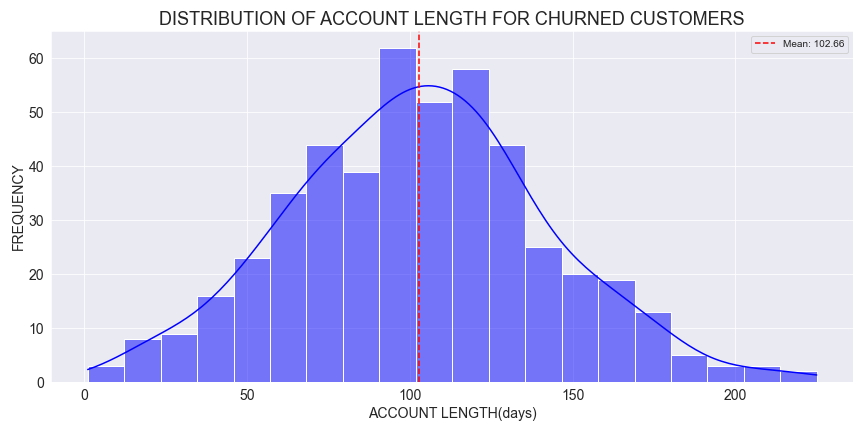

# SYRIATEL-CUSTOMER-CHURN-PREDICTION-PROJECT
This project aims to build a classifier to predict whether a customer will ("soon") stop doing business with SyriaTel, a telecommunications company. This is a binary classification problem. The project entails data preprocessing, analysis, model selection, and evaluation to achieve accurate and actionable predictions. The stakeholders here are the company's management and data science team, who are interested in reducing money lost because of customers who don't stick around very long.

### BUSINESS OVERVIEW
Customer churn refers to customers ceasing to do business with a company, often either switching to competitors or stopping altogether. For SyriaTel, churn directly affects revenue and profitability, making it essential for the company to address churn proactively. Reducing churn is vital for retaining customers, sustaining growth, and remaining competitive.

Detecting churn involves several processes including identifying reduced usage, increased complaints, or payment changes. However, challenges are still faced when trying to detect and address churns. For instance, while modern machine learning techniques improve accuracy, challenges like class imbalances and evolving customer behaviors complicate the process. Additionally, external factors, like market conditions further influence customer decisions, requiring businesses like SyriaTel to adapt their strategies continuously.

To tackle this project, a structured approach is needed. This includes data analysis and training machine learning models to identify at-risk customers. By leveraging insights from these models, SyriaTel can adopt targeted retention strategies, like enhanced customer service, to reduce churn and improve customer satisfaction.

### PROBLEM STATEMENT:
SyriaTel struggles with a significant loss in revenue due to customer churn but lacks a data-driven approach to proactively identify customers that are likely to churn and mitigate the issue sooner.
This project aims to develop a machine learning model to help predict churn and provide actionable insights to help SyriaTel better retain its customers and enhance customer loyalty.

### OBJECTIVES:
1. Develop a machine learning classifier to predict customer churn, categorizing customers as "churn"(True) or "non-churn" (False).
2. Utilize logistic regression for probabilistic predictions and feature interpretability.
3. Leverage decision trees for capturing nonlinear patterns and generating intuitive decision rules.
4. Evaluate model performance using precision, recall, F1-score, and AUC-ROC to ensure reliable predictions.
5. Support SyriaTel in deploying data-driven strategies to minimize churn and improve customer loyalty.

### METRICS OF SUCCESS:
To evaluate and compare the performance of the models, the following metrics will be used:
- Precision: Measures the accuracy of predicting churn among all predicted churners, ensuring minimal false positives.
- Recall (Sensitivity): Captures the ability to identify all actual churners, minimizing false negatives.
- F1-Score: Balances precision and recall, providing a single metric for performance on imbalanced data.
- AUC-ROC: Assesses the model’s ability to distinguish between churners and non-churners across all thresholds.
These metrics help us confirm the model performs well on the dataset and generalizes effectively to unseen data.

### DATA SOURCE:
The dataset used in this project is sourced from Kaggle, titled "[Churn in Telecoms](https://www.kaggle.com/datasets/becksddf/churn-in-telecoms-dataset)." It's a CSV file that contains information on customer demographics, service usage, and other features to predict telecom churn. You can access it here.

### DATA ANALYSIS
Exploratory Data Analysis was carried out where missing values and duplicates were checked. Further analysis was conducted to better understand what features affected churn. Some of the findings of the analysis are briefly discussed and visualized below.

1. CLASS IMBALANCE

There's a substantial imbalance in our dataset. 85.5% of the rows belong to the "False" class while 14.5% of rows belong to the "True" class. This also shows that 15% of customers at SyriaTel have churned

2. AREA CODES

From the area code visualization, it was observed that area code 415 has the highest number of SyriaTel customers, followed by area code 510, and lastly area code 408. This distribution, however, is most likely influenced by the population size of these areas.

3. CHURNS vs CUSTOMER SERVICE CALLS

 States with the highest number of churned customers and also had the highest number of customer service calls.

4. DISTRIBUTION OF ACCOUNT LENGTH FOR CHURNED CUSTOMERS

For churned customers, the average length of their accounts before churning was 102 days.

### MODELING
Classification models were built and evaluated to predict customer churn. The modeling process is carried out iteratively, progressively refining the models to achieve optimal performance. For each classifier, a baseline model was built and further optimizations were made on the baseline. 
Logistic regression is the model of choice thanks to its simplicity and statistical interpretability, and a transition to decision trees was made as they complement the logistic regressions by offering insights into feature importance and complex decision boundaries. Both models are evaluated on key performance metrics discussed earlier.

The ultimate goal for modeling was to identify the best-performing model that can generalize well to unseen data and provide actionable insights into customer churn.

### FINAL MODEL
The final model, an optimized decision tree, achieved a decent balance between accuracy and interpretability. By preprocessing categorical variables with one-hot encoding and incorporating key numerical features like account length and customer service calls, the model performed well. Hyperparameter tuning further enhanced performance, achieving 87% accuracy and an AUC-ROC of 0.7024, with features such as customer service calls and international plans identified as critical churn predictors.

### RECOMMENDATIONS
These are some of the recommendations given; 
1. Enhance customer service: Improve efficiency and quality of customer service to resolve issues quickly and efficiently and reduce churn, as high customer service calls signal dissatisfaction.

2. Consider offering tailored and improved plans for international users: Design flexible international plans and conduct targeted marketing to address dissatisfaction among users of these plans.

3. Identify at-risk clients early: Use the model predictions to create a warning system for at-risk customers, deploying personalized offers, discounts, or loyalty rewards to retain them.

4. Improve data collection strategies: Ensure data collected is diverse and useful for better analysis and modeling in the future.

### CONCLUSION
This analysis identified key predictors of churn, which include international plan(whether a customer has an international plan or not), customer service calls(the number of calls the clients have made to customer service calls, and account length(how long the customer has been with the company). Logistic regression initially outperformed in accuracy and AUC-ROC, but an optimized decision tree, enhanced through hyperparameter tuning and feature refinement, ultimately delivered a more balanced performance. Efforts to address class imbalance using SMOTE improved recall for the minority class, while ADASYN had limited impact. The optimized decision tree was selected as the final model, though further tuning is recommended to improve recall and ensure robust churn predictions.

### NEXT STEPS
1. Further tune and perfect the model: Explore more complex models like random forests or further tune the models built here for improved generalization.

2, Model deployment: After further fine-tuning and perfecting, deploy the optimized decision tree model into production, ensuring it's accessible to end-users for real-time predictions of customer churn.

3. Monitor the model performance: Track the model's performance over time to ensure it maintains its predictive accuracy and to identify any drift.

4. Collect more data that is also diverse: Collect additional data, especially on features like customer demographics, usage patterns, and service plans, to improve model robustness.
